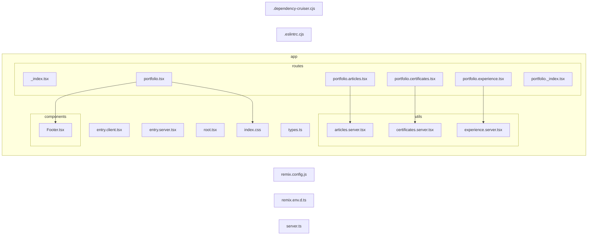

依存関係について。

Rust / Go で依存関係を調べていた。

その中で、TypeScript の依存関係を可視化する方法について考えた。

[dependency-cruiser](https://github.com/sverweij/dependency-cruiser) というものがあるらしい。

https://github.com/sverweij/dependency-cruiser

これで、TypeScript の依存関係を可視化できる。

CI に組み込んでおけば、認知負荷を下げることができるかもしれない。

実際に作成した Project はこれ。

https://github.com/danny-yamamoto/my-portfolio-remix-v2

## Installation
```bash
npm i -D dependency-cruiser
npx depcruise --init
```

## Initialize
定義を作成する。

```bash
node ➜ /workspaces/my-portfolio-remix-v2 (main) $ npx depcruise --init
✔ It looks like this is an ESM package. Is that correct? … yes
✔ Where do your source files live? … app
✔ Do your test files live in a separate folder? … no
✔ Looks like you're using a 'tsconfig.json'. Use that? … yes
✔ Full path to your 'tsconfig.json › tsconfig.json
✔ Also regard TypeScript dependencies that exist only before compilation? … no

  ✔ Successfully created '.dependency-cruiser.cjs'

npm notice 
npm notice New major version of npm available! 9.8.1 -> 10.2.4
npm notice Changelog: https://github.com/npm/cli/releases/tag/v10.2.4
npm notice Run npm install -g npm@10.2.4 to update!
npm notice 
node ➜ /workspaces/my-portfolio-remix-v2 (main)
```

```bash
node ➜ /workspaces/my-portfolio-remix-v2 (main) $ npx depcruise --include-only "^app"  --config .dependency-cruiser.cjs .

  warn no-orphans: app/routes/portfolio._index.tsx
  warn no-orphans: app/routes/_index.tsx
  warn no-orphans: app/root.tsx
  warn no-orphans: app/entry.server.tsx
  warn no-orphans: app/entry.client.tsx

✘ 5 dependency violations (0 errors, 5 warnings). 15 modules, 5 dependencies cruised.

node ➜ /workspaces/my-portfolio-remix-v2 (main) $
```

## Visualization
```bash
node ➜ /workspaces/my-portfolio-remix-v2 (main) $ npx depcruise --config -x "^(build|functions|node_modules|public)" .dependency-cruiser.cjs . --output-type mermaid > depcruise.md
```

markdown で表示させるため、コードブロックで `mermaid` を指定する。
```diff
+```mermaid
flowchart LR

0[".dependency-cruiser.cjs"]
1[".eslintrc.cjs"]
subgraph 2["app"]
subgraph 3["components"]
4["Footer.tsx"]
end
5["entry.client.tsx"]
6["entry.server.tsx"]
7["root.tsx"]
subgraph 8["routes"]
9["_index.tsx"]
A["portfolio._index.tsx"]
B["portfolio.articles.tsx"]
E["portfolio.certificates.tsx"]
G["portfolio.experience.tsx"]
I["portfolio.tsx"]
end
subgraph C["utils"]
D["articles.server.tsx"]
F["certificates.server.tsx"]
H["experience.server.tsx"]
end
J["index.css"]
K["types.ts"]
end
L["remix.config.js"]
M["remix.env.d.ts"]
N["server.ts"]
B-->D
E-->F
G-->H
I-->J
I-->4
+ ```
```

## Open Preview
完成。



https://github.com/danny-yamamoto/my-portfolio-remix-v2/blob/main/depcruise.md
