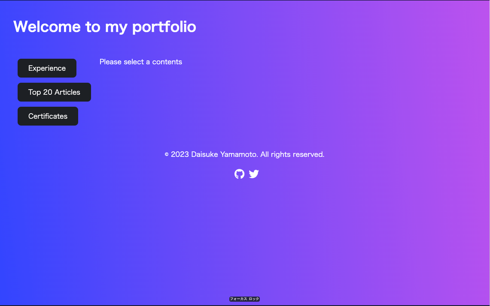
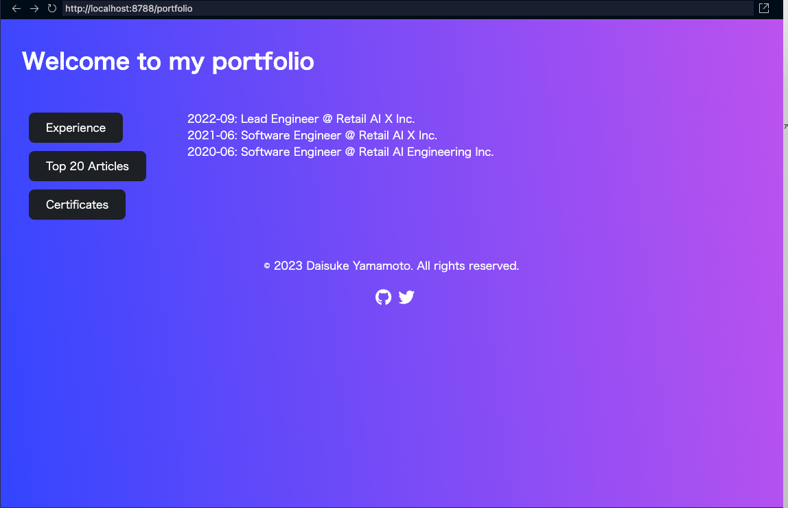

## Introduction
Remix v2 で App を構築する過程で学んだことの一部を残す。

## Background
このメモ作成時（2023年10月）の現職の Frontend は、Vue/Nuxt、React/Gatsby など複数の構成が存在する。

デファクトと言える Next.js は、数ある Framework の中で最もユーザーが多く、コミュニティーが活発。
一方で、Next.js を Vercel 以外、例えば Cloud Run で動かす場合、恩恵を受けられないことがある。deploy の手軽さが違う。
また、Vercel としても他の platform で使われると開発する incentive がない。

その他の Framework を問われると、monetize がはっきりしているものが妥当な選択肢となる。

そこで、Shopifyと提携した Remix を検証する。

v2 が release されたため、大きな変更の1つである flat routes とその他の変更点について調べる。

https://github.com/danny-yamamoto/my-portfolio-remix-v2

## Overview
### Flat routes
v1 で future flags を有効にしたため、flat routes は経験した。
v2 における flat routes の実装方法に、変更なかった。

> Also in v1.11 we added "flat" routing, which simplifies doing nested layouts without requiring nested directories. This is the default in v2[^1]
>
> また、v1.11では "フラット "ルーティングが追加され、ネストされたディレクトリを必要とせず、ネストされたレイアウトを簡単に行えるようになりました。これはv2のデフォルトです。

[^1]: https://remix.run/blog/remix-v2

構成は、以下の通り。一部分かりやすいように修正してある。

```html
      <div className="flex-container">
        <div className="flex-item">
          <h2 id="experience"><Link to={`/portfolio/experience`}>Experience</Link></h2>
          <h2 id="articles"><Link to={`/portfolio/articles`}>Top 20 Articles</Link></h2>
          <h2 id="certificates"><Link to={`/portfolio/certificates`}>Certificates</Link></h2>
        </div>
        <div>
          <Outlet />
        </div>
      </div>
```

```bash
│   ├── routes
│   │   ├── _index.tsx
│   │   ├── portfolio.articles.tsx      // Outlet
│   │   ├── portfolio.certificates.tsx  // Outlet
│   │   ├── portfolio.experience.tsx    // Outlet
│   │   ├── portfolio._index.tsx        // Outlet
│   │   └── portfolio.tsx               // layout
```

`Outlet` の初期表示は、`portfolio._index.tsx`。



コンテンツを選択すると、`Outlet` がプレースメントとして働き、`portfolio.experience.tsx` を表示される。URL は変わらない。



### React Server Components (RSC)
v3 でのサポートが検討されている。

> The tl;dr is that we are optimistic about adding support for RSC in Remix v3 and we are anxious to do our part in the effort to prove the technology in multiple frameworks. The capabilities of RSC are interesting, but Remix v2 relies on current stable React features, which at the time of this writing doesn't include RSC. When RSC is stable, you can expect that Remix will support it.[^1]
>
> 要するに、私たちはRemix v3でRSCをサポートすることを楽観視しており、複数のフレームワークでこの技術を証明する努力の一端を担うことを切望しているということだ。RSCの機能は興味深いが、Remix v2は現在の安定したReactの機能に依存しており、この記事を書いている時点ではRSCは含まれていない。RSCが安定すれば、Remixはそれをサポートすることになるでしょう。
