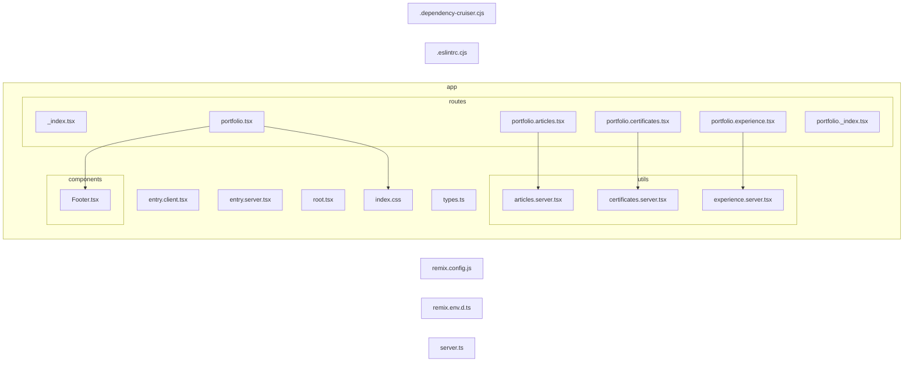

```mermaid
flowchart LR

0[".dependency-cruiser.cjs"]
1[".eslintrc.cjs"]
subgraph 2["app"]
subgraph 3["components"]
4["Footer.tsx"]
end
5["entry.client.tsx"]
6["entry.server.tsx"]
7["root.tsx"]
subgraph 8["routes"]
9["_index.tsx"]
A["portfolio._index.tsx"]
B["portfolio.articles.tsx"]
E["portfolio.certificates.tsx"]
G["portfolio.experience.tsx"]
I["portfolio.tsx"]
end
subgraph C["utils"]
D["articles.server.tsx"]
F["certificates.server.tsx"]
H["experience.server.tsx"]
end
J["index.css"]
K["types.ts"]
end
L["remix.config.js"]
M["remix.env.d.ts"]
N["server.ts"]
B-->D
E-->F
G-->H
I-->J
I-->4
```
